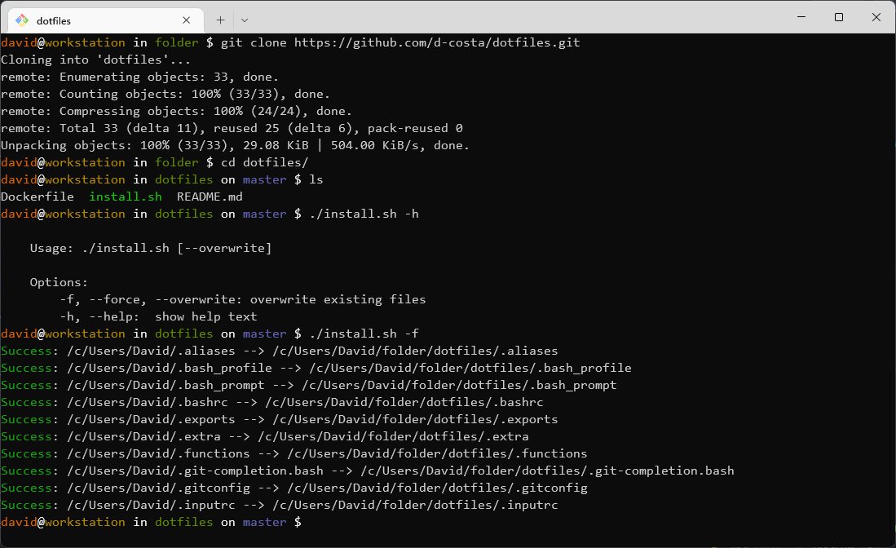

# Dotfiles



## Usage

```bash
./install.sh
```

Will create symbolic links for each dotfile present in this repository to your $HOME.


## Try it out

```bash
docker build -t dot-image .
docker run --rm -it dot-image
```

## Acknowledgments

https://github.com/mathiasbynens/dotfiles
